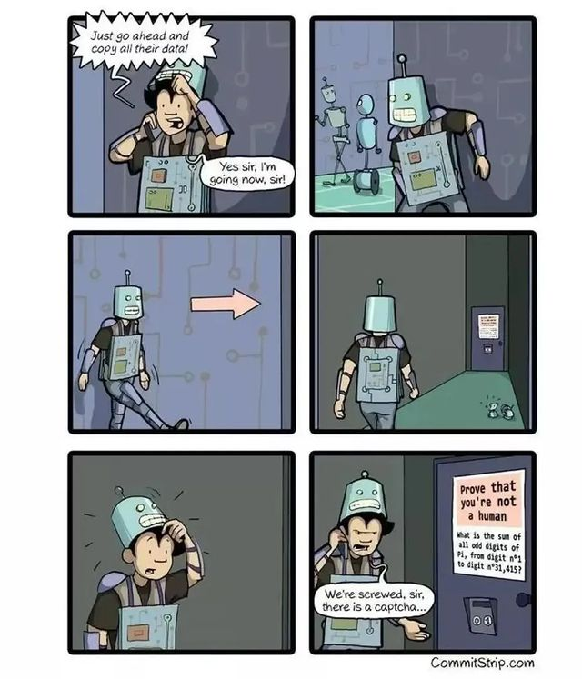

# Pi digits

[![lint][lint-image]][lint-url]

This library was created inspired in solving this meme where there is a CAPTCHA to detect if someone is a robot or not, becuase its a calculation to hard for a human. Now we solve it in less than a second.



## Getting started

Install the library with:

```sh
pip install -U py-digits
```

### Usage

```python
from pydigits import sum_pi_digits

print(sum_pi_digits(31_415, 'odd'))
# 78662

print(sum_pi_digits(31_415, 'odd', 'binary'))
# 10011001101000110
```

## Testing

Run the test suite with:

```sh
python -m unittest tests
```

To install it locally from the source code:

```sh
python setup.py develop
```

## Publish

```sh
python setup.py register sdist upload
```

[ci-image]: https://travis-ci.org/Baelfire18/pi-digits.svg
[ci-url]: https://travis-ci.org/Baelfire18/pi-digits
[lint-image]: https://codeclimate.com/github/Baelfire18/pi-digits/badges/gpa.svg
[lint-url]: https://codeclimate.com/github/Baelfire18/pi-digits
